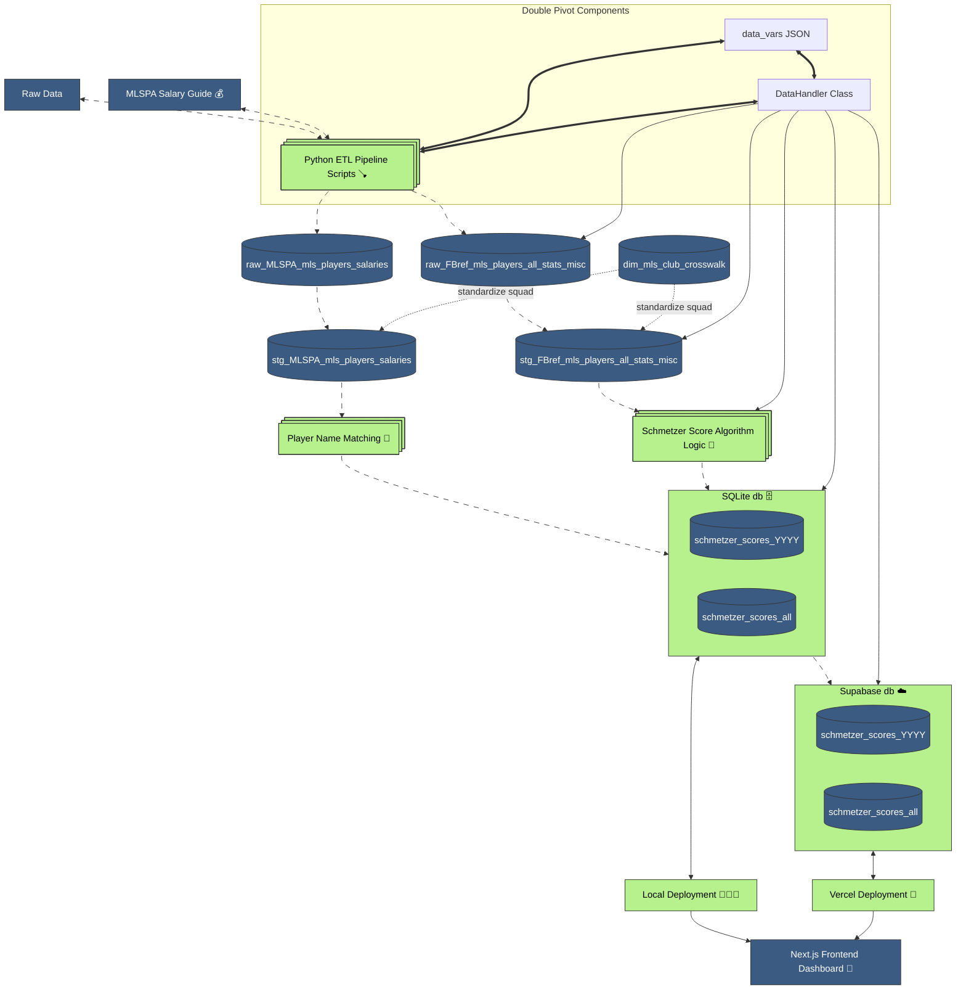

# duels_mapping

[](https://duels-mapping.vercel.app/)

**Deployment URL: <https://duels-mapping.vercel.app/>**

## Contested Possession Metric AKA The Schmetzer Score

Welcome to **_duels_mapping_**, a code repository which supports a new composite sports statistic: the **`Contested Possession Metric`** -- a method for rating a player's ability to win and/or keep possession. Since `Contested Possession Metric` is a bit of a mouthful, we've dubbed it the `Schmetzer Score`. Sounders supporters like myself have watched many-a press conferences where Coach Schmetzer will tap his pen on the table and reference his preferred statistic: _duels won_. In an effort to create a fuller picture of how possession is won/maintained, I have weighted aerial duels won, aerial duels lost, tackles won, interceptions, and recoveries using a custom algorithm to measure this skill by player and across the league.

Since a player's contribution is only half of the story, Duels Mapping also carries publicly disclosed MLS salary data alongside the Schmetzer Score, so a player's work can be read against what their club committed to pay for it -- and so you can see which clubs are getting the most contested possession per dollar.

### tl;dr

The Duels Mapping repo powers the custom **Schmetzer Score** — a composite statistic for MLS players — by transforming raw FBref data through a lightweight, extensible SQLite-based ETL pipeline primarily written in Python, delivering that data to a Postgres database in the cloud and finally visualizing this data in an intuitive and interactive Next.js front end dashboard. A second pipeline pulls publicly disclosed MLSPA salary data alongside it, so every player's contribution can be read against what their club paid for it.

### Update 03/2026

Unfortunately, as you may have already read [here](https://www.sports-reference.com/blog/2026/01/fbref-stathead-data-update/) or [here](https://www.nytimes.com/athletic/7002196/2026/01/28/fbref-opta-football-data-soccer-analytics/), the FBref advanced data this project relies on is no longer publicly available. In January 2026, Opta terminated Sports Reference's access to its data feeds, citing an alleged agreement violation ending free access to the advanced statistics that aspiring sports data analysts and soccer fans had come to love. As a result, further development beyond the 2025 season will not be possible until we find a new data source. In the meantime, Duels Mapping remains fully functional as a historical record, offering insights into player performance and league trends from 2018–2025.

## Table of Contents

[Quick Setup](#quick-setup)  
[Development Installation & Setup](#development-installation--setup)  
[Data Environment](#data-environment)  
[Double Pivot (Recurring Data Drivers)](#double-pivot-recurring-data-drivers)  
[Flow of Data](#flow-of-data)  
[Data Modeling & ETL Pipeline Development](#data-modeling--etl-pipeline-development)  
[Salary Data & The Schmetzer Value Metric](#salary-data--the-schmetzer-value-metric)  
[Squad Name Standardization](#squad-name-standardization)  
[File Structure & Directory Layout](#file-structure--directory-layout)  
[Future Development](#future-development)  
[Shout Outs](#shout-outs)

## Quick Setup

This repo uses a git submodule for the data environment. After cloning, initialize it with:

`git submodule update --init`

The Next.js app are within a subdirectory, so to install the node package modules, run the command:

`( cd app-duels-mapping ; npm install )`

If you want to run the application in developer mode (assuming you have the Node packages installed), run the command:

`( cd app-duels-mapping ; npm run dev )`

If you're looking to get rolling with the application immediately (assuming you have the Node packages installed), run the command:

`( cd app-duels-mapping ; npm run build ; npm run start )`

Either run command will fire up the Next.js app (you can also change directories and run the commands individually). Once it's ready simply navigate to <http://localhost:3000/>

You can review players raw stats as well as Schmetzer Score and a rank for that season. Clicking on a player will display a deep dive into that player's numbers and also present a year-over-year look at that player's Schmetzer Score across all seasons played in MLS going back to 2018 when these statistics first came available. The dashboard also has a `Comparisons` tool, allowing the user to explore 1v1 player match-ups and revealing data that can be critical strategizing in-game tactics, performance analysis, and scouting/recruitment opportunities.

### Development Installation & Setup

For convenience I've built out a bash script at the root of the project, [duels_mapping.sh](./duels_mapping.sh). There are instructions commented out near the top of the file and below is a quick summary. Before running, you'll need to build a .env file at the root of the project which contains information on your Python virtual environment and accessing Supabase. Only a few variables are needed. If you'd like to match my process, I typically name my virtual environment to match the repo and do the same in Supabase. Below is an example (with secure information as #####):

```
# # Python Virtual Environment
VENV_NAME=duels_mapping
VENV_PATH=/Users/pathto/.virtualenvs/duels_mapping/bin/activate
# # Database Settings
SUPABASE_ORG=#####
SUPABASE_PROJECT_NAME=duels-mapping
SUPABASE_DB_PASSWORD=#####
SUPABASE_URI=#####
SUPABASE_URL=#####
SUPABASE_ANON_KEY=#####
```

_Note: you will need to adjust the path below as appropriate on your machine. I use [virtualenvwrapper](https://virtualenvwrapper.readthedocs.io/en/latest/). You may need to adjust if you use [venv](https://docs.python.org/3/library/venv.html)._

- If this is the first time you are using this app, run the "setup" command from a terminal at the root of the project. Bear in mind this will overwrite your databases (you will need to setup a database and tables in Supabase for the last step in the pipeline) and leverage your machine for computing (e.g. extracting data through a browser, utilizing the file system for SQLite, etc).
  - `source ./duels_mapping.sh setup` OR `. ./duels_mapping.sh setup`
  - First the virtual environment will be activated.
  - Next the dependencies from the `requirements.txt` file will be installed.
  - Finally the terminal will navigate to the the Next.js app `cd app-duels-mapping`, run the `npm run dev` command, open a browser at <http://localhost:3000/api/schmetzer_scores/2025>, and send you on your way.

- If the data for the current season needs to be updated, run the "update" command from a terminal at the root of the project.
  - `source ./duels_mapping.sh update` OR `. ./duels_mapping.sh update`
  - First the virtual environment will be activated.
  - The `pipeline_cur_FBref_misc_stats_to_schmetzer_scores_players.py` script will be run to update the current season's data.
  - Finally the terminal will navigate to the the Next.js app `cd app-duels-mapping`, run the `npm run dev` command, open a browser at <http://localhost:3000/api/schmetzer_scores/2025>, and send you on your way.

- To start further development, run the "start" command from a terminal at the root of the project.
  - `source ./duels_mapping.sh start` OR `. ./duels_mapping.sh start`
  - This command will simply activate the virtual environment and send you on your way.

- Similarly to deactivate the virtual environment, run the "stop" command from a terminal at the root of the project.
  - `source ./duels_mapping.sh stop` OR `. ./duels_mapping.sh stop`
  - This command will simply deactivate the virtual environment and send you on your way.

- If the MLSPA has published a new salary release, run the "salaries" command from a terminal at the root of the project.
  - `source ./duels_mapping.sh salaries` OR `. ./duels_mapping.sh salaries`
  - The `pipeline_cur_MLSPA_salaries_to_schmetzer_scores_players.py` script will be run to load the newest release configured in `data_vars.json`.
  - To backfill every season of salary data instead, use `salaries-restore`.
  - Note these pipelines read the `schmetzer_scores_YYYY` tables, so they run *after* the FBref pipelines have built them.

- If you ever need to conduct a data restore, run the "restore" command from a terminal at the root of the project.
  - `source ./duels_mapping.sh restore` OR `. ./duels_mapping.sh restore`
  - The `pipeline_hist_FBref_misc_stats_to_schmetzer_scores_players.py` script will be run to backfill all data.
  - The `pipeline_hist_MLSPA_salaries_to_schmetzer_scores_players.py` script then backfills every season of salary data on top of it.
  - Finally the terminal will navigate to the the Next.js app `cd app-duels-mapping`, run the `npm run dev` command, open a browser at <http://localhost:3000/api/schmetzer_scores/2025>, and send you on your way.

## Data Environment

The duels_mapping data environment is contained within the [app-duels-mapping/public/duels_mapping_data](app-duels-mapping/public/duels_mapping_data) directory and includes the SQLite database which serves as a data warehouse, ETL pipelines for sourcing and delivery of statistics, and the SQL scripts that set up the data environment, ingest and transform data, and generate the statistics consumed by the Next.js frontend dashboard which rates MLS players based on aerial duels won vs lost, tackles won, interceptions, and recoveries.

The original concept of this application was as an app proprietary to the club and installed on the tablets, laptops, and mobile devices of coaching staff. To make the application publicly available I've extended the data pipelines to upload to a Postgres database in the cloud using Supabase and deployed to Vercel: <https://duels-mapping.vercel.app/>.

If you're this deep in the project, you're my kind of people ⚽️

### Double Pivot (Recurring Data Drivers)

As you may have guessed football tactics have been a major driver in this project and in fact part of the architecture was lifted right off the pitch. In soccer, a double pivot refers to a pairing of central defensive midfielders who play a key role to both defense and offense--winning possession, progressing the ball up the field, and providing tactical versatility. This data architecture adopts that same concept. It features two core pivot components that orchestrate the flow of data.

1. [`data_vars.json`](app-duels-mapping/public/duels_mapping_data/data_vars.json)  
   This JSON file stores the values used to calculate the Schmetzer Score metric. The stats can be weighted differently to allow flexible experimentation and tuning of how each individual statistic influences the overall score. This access point supports extension to include more data sources, additional ETL pipelines, and the creation of new composite metrics built off other advanced sports statistics.

2. [`DataHandler`](app-duels-mapping/public/duels_mapping_data/etl/data_handler.py)

   This class handles and executes the ETL workflow, including extracting, parsing, loading, and transforming the data. Inspired by Apache Airflow DAGs, its modular methods make it easy to plug in additional pipelines and customize workflows.

   `DataHandler` is the **superclass**. Everything every pipeline needs -- the `data_vars.json` configuration, the database connection, running a SQL script, listing the season tables, and the upload to Supabase -- lives on it. Anything specific to one data source belongs in a **subclass named for that source**, so adding a pipeline means adding a subclass rather than another method on a shared class. The first of these is [`MLSPADataHandler`](app-duels-mapping/public/duels_mapping_data/etl/mlspa_data_handler.py), which owns the salary workflow end to end.

   The FBref methods still sit on `DataHandler` itself, which predates this split. They work as they always have and the existing pipelines are untouched; when they are next revisited they should move to an `FBrefDataHandler` subclass to match the pattern above.

### Flow of Data

The Mermaid diagram below illustrates how data flows through the processing pipeline from ingestion of raw data to frontend visualization. This flowchart provides both a high-level and component-level understanding of how raw data becomes actionable insights.


```mermaid
flowchart TD
    %% Supporting pivots (vertical layout, side-by-side with main flow)
    subgraph PIVOTS [Double Pivot Components]
        direction TB
        DV[data_vars JSON]
        DH[DataHandler Class]
        PY[Python ETL Pipeline Scripts 🪠]
    end

%% Main pipeline
    A[Raw Data] e1@<--> PY
    PY e2@--> C[(raw_FBref_mls_players_all_stats_misc)]
    C e3@--> D[(stg_FBref_mls_players_all_stats_misc)]
    D e4@--> ALGO[Schmetzer Score Algorithm Logic 🧮]

    %% Salary pipeline
    S[MLSPA Salary Guide 💰] e7@<--> PY
    PY e8@--> SR[(raw_MLSPA_mls_players_salaries)]
    SR e9@--> SS[(stg_MLSPA_mls_players_salaries)]
    SS e10@--> MATCH[Player Name Matching 🔗]
    MATCH e11@--> SQLITE

    %% Shared crosswalk: both staging loads resolve club spellings through it
    XWALK[(dim_mls_club_crosswalk)]
    XWALK -.->|standardize squad| D
    XWALK -.->|standardize squad| SS

    %% SQLite group
    subgraph SQLITE [SQLite db 🗄️]
        F[(schmetzer_scores_YYYY)]
        G[(schmetzer_scores_all)]
    end

    %% Supabase group
    subgraph SUPABASE [Supabase db ☁️]
        F2[(schmetzer_scores_YYYY)]
        G2[(schmetzer_scores_all)]
    end

    %% Frontend and deployment
    V[Vercel Deployment 🚀]
    L[Local Deployment 👩🏾‍💻]
    N[Next.js Frontend Dashboard 💫]

    %% DB integrations
    ALGO e5@--> SQLITE
    SQLITE <--> L
    SQLITE e6@--> SUPABASE
    SUPABASE <--> V
    L --> N
    V --> N

    %% Connections from pivots
    DV <==> DH
    DV <==> PY
    DH <==> PY
    DH --> C
    DH --> D
    DH --> ALGO
    DH --> SQLITE
    DH --> SUPABASE

    %% styling legend
    classDef dataNode fill:#3b5b83,stroke:#333,stroke-width:1px,color:#fff;
    classDef logicNode fill:#b6f18e,stroke:#333,stroke-width:1px,color:#000;
    classDef animate stroke-dasharray: 9,5,stroke-dashoffset: 900,animation: dash 25s linear infinite;
    class e1,e2,e3,e4,e5,e6,e7,e8,e9,e10,e11 animate
    class A,C,D,F,G,F2,G2,N,S,SR,SS,XWALK dataNode
    class PY,ALGO,SQLITE,SUPABASE,V,L,MATCH logicNode
    PY@{ shape: procs}
    ALGO@{ shape: procs}
    MATCH@{ shape: procs}

```

### Data Modeling & ETL Pipeline Development

All tables are created using the SQL in the [app-duels-mapping/public/duels_mapping_data/etl/sql/create](app-duels-mapping/public/duels_mapping_data/etl/sql/create) directory. For simplicity, readability, extensibility the filename matches the name of the table.

`dim_schmetzer_score_points` - This is the only **dim table** leveraged by the Schmetzer Score metric. While the values are static as seen below, they are controlled by the aforementioned [data_vars.json](app-duels-mapping/public/duels_mapping_data/data_vars.json) and are inserted using Python subsequent to all table creation. Below is the table in full for visibility into individual stat values and because it's a pretty small table 🙃

| stat_name         | point_value | abbrev        |
| ----------------- | ----------- | ------------- |
| aerial duels won  | 1           | duels won     |
| aerial duels lost | -0.85       | duels lost    |
| tackles won       | 1.5         | tackles won   |
| interceptions     | .9          | interceptions |
| recoveries        | .25         | recoveries    |

#### Weight Fine-Tuning

These are not the weights the project launched with. In 2026 every weight was reviewed against the full database -- 5,876 player-seasons across 2018-2025 -- and four of the five changed.

| Stat              | Initial Weight | Fine-Tuned Weight |
| ----------------- | -------------- | ----------------- |
| Aerial duels won  | +1             | +1                |
| Aerial duels lost | -0.75          | **-0.85**         |
| Tackles won       | +1             | **+1.5**          |
| Interceptions     | +0.75          | **+0.9**          |
| Recoveries        | +0.5           | **+0.25**         |

The finding driving the change is that **a weight is not an influence**. Recoveries carried the smallest weight and the largest effect, purely on volume: 339,947 recoveries in the database against 66,056 tackles won. More than half of every point the score awarded was a recovery, and score-per-90 correlated 0.78 with recoveries against 0.26 with aerial duels won -- a metric named for duels was not primarily measuring duels. Cutting recoveries to +0.25 takes them from 55% of all points awarded to 32%, and from the largest single influence on the score to the smallest.

`tackles won` rises to +1.5 for the mirror-image reason. Tackles are both rarer and more tightly clustered than aerial duels (0.98 vs 1.25 per 90; standard deviations of 0.52 vs 0.99), so matching them at +1 gave them materially less pull on the ranking. Per-event parity would put the weight at 1.27 and fully equal influence at 1.89; +1.5 sits at the geometric middle of that range. The ceiling was deliberately avoided because tackles won is the least stable stat in the set -- its year-over-year correlation within position is 0.606 and falls a further 0.144 when a player changes clubs, the largest such drop of the five, indicating it travels with a team's defensive scheme.

`aerial duels lost` moves to -0.85. League-wide, aerial duels won and lost are the same number (85,314 vs 85,318) because every duel has one winner and one loser, so the two aerial weights do not set a value -- they set a **break-even win rate** of `k / (1 + k)`. At -0.75 that was 42.9%, well under what an ordinary contested player manages, so the aerial term was effectively paying for volume. At -0.85 it is 45.9%: correlation with raw duel volume drops from 0.395 to 0.287 while correlation with actual win rate reaches its plateau. The original design intent survives -- the median outfielder with real aerial volume wins 49.2%, so a genuine coin-flip still nets positive.

`interceptions` rises to +0.9 on the strength of the secondary "keeps possession" criterion, while staying clearly below tackles because no opponent is beaten in a contest. The restraint is also empirical: interceptions are the most positional and least individually discriminating stat in the set, with 37.5% of variance explained by position alone and a within-position year-over-year reliability of 0.559, the lowest of the five.

Two consequences worth knowing. Rankings move less than the weights suggest -- Spearman correlation with the previous ranking is 0.990, because a season total is driven first by minutes played, and only four or five names change in a given season's top 25. And because four of five values fell, **every score in the database is now lower**: the league mean drops roughly 16%. That is a rescale, not a regression, but any figure quoted from a previous run is stale.

Retuning the weights is a `data_vars.json` edit plus `insert_dim_schmetzer_score_points()`, which upserts on `stat_name`. Do **not** reach for `create_tables()` to refresh the dim table -- it drops every table including the FBref raw and staging tables, which can no longer be re-sourced. The rebuild path after a weight change is: `insert_dim_schmetzer_score_points()`, then `insert_schmetzer_scores_players(seasons=...)` passing the seasons already in the database, then `update_schmetzer_scores_players_salaries()`, and finally `insert_schmetzer_scores_all_seasons()` -- the all-seasons table must be rebuilt **after** the salary update or it copies null salary columns.

`dim_mls_club_crosswalk` - The second **dim table**. Every source spells MLS clubs differently: FBref writes `Atlanta Utd` and `Vancouver W'caps`, the MLSPA writes `Atlanta United` and `Vancouver Whitecaps`, and both have renamed clubs over the years (`Montreal Impact` became `CF Montréal`). This table resolves any of those spellings to the one squad name the app displays, so a club reads identically whichever pipeline the row arrived through. See [Squad Name Standardization](#squad-name-standardization) below.

Like the dim table above, its values are controlled by [data_vars.json](app-duels-mapping/public/duels_mapping_data/data_vars.json) -- `mls_squad_names` lists the canonical names and `fbref_squad_aliases` / `mlspa_club_aliases` map each source's spellings onto them -- and are inserted using Python after table creation. A `NULL` squad marks an MLSPA bucket that is not a club at all: `MLS Pool`, `Retired`, `Without a Club`.

The table is keyed on `(club_alias, source)` rather than on the alias alone, because the two feeds share some spellings (`LAFC`, `Toronto FC`) while disagreeing on others.

| Column Name | Data Type | Description                                                     |
| ----------- | --------- | --------------------------------------------------------------- |
| club_alias  | Text      | A club name exactly as one of the sources spells it              |
| source      | Text      | `fbref` or `mlspa` -- which feed uses this spelling              |
| squad       | Text      | The canonical squad name; NULL when the alias is not a club      |

`raw_FBref_mls_players_all_stats_misc` - The **raw table** for this workflow, this table serves as a first destination once the extracted data is sourced and parsed using Python and a Pandas Dataframe. In order to conserve on resources and keep the data as close to the original as possible very little in the way of transformation occurs (the only changes being as noted below).

| Column Name   | Data Type | Description                                                                                        |
| ------------- | --------- | -------------------------------------------------------------------------------------------------- |
| season        | Integer   | Year of season                                                                                     |
| player        | Text      | Player's name                                                                                      |
| nation        | Text      | Player's nationality                                                                               |
| pos           | Text      | Player's position                                                                                  |
| squad         | Text      | Player's team                                                                                      |
| age           | Integer   | Player's age at start of season                                                                    |
| born          | Integer   | Player's year of birth                                                                             |
| nineties      | Real      | Minutes played ÷ 90 (renamed from '90s' as column names cannot start with a number)                |
| crdy          | Integer   | Yellow cards                                                                                       |
| crdr          | Integer   | Red cards                                                                                          |
| second_crdy   | Integer   | Second yellow cards (renamed from '2crdy' as column names cannot start with a number)              |
| fls           | Integer   | Fouls committed                                                                                    |
| fld           | Integer   | Fouls drawn                                                                                        |
| off           | Integer   | Offside                                                                                            |
| crs           | Integer   | Crosses                                                                                            |
| intercept     | Integer   | Interceptions (renamed from 'int' as more descriptive alias)                                       |
| tklw          | Integer   | Number of tackles won                                                                              |
| pkwon         | Integer   | Number of PKs won                                                                                  |
| pkcon         | Integer   | Number of PKs conceded                                                                             |
| og            | Integer   | Number of own goals scored                                                                         |
| recov         | Integer   | Number of recoveries                                                                               |
| duels_won     | Integer   | Number of aerial duels won (renamed from 'won' as more descriptive alias)                          |
| duels_lost    | Integer   | Number of aerial duels lost (renamed from 'lost' as more descriptive alias)                        |
| load_datetime | Timestamp | Load timestamp with time zone (added for tracking data reliability and ETL performance monitoring) |

`stg_FBref_mls_players_all_stats_misc` - The **staging table** receives all data transformed to correct data types, calculates and adds columns for _aerial_duels_total_ (sum of all duels) and _aerial_duels_won_pct_ (duels won realized as a percentage), as well as renames some columns (italicized in the table below) to be more descriptive in the context of the mls_stats database (i.e. primarily to prevent confusion between player and team stats).

| Column Name          | Data Type | Description                                                                                    |
| -------------------- | --------- | ---------------------------------------------------------------------------------------------- |
| season               | Integer   | Year of Season                                                                                 |
| _player_name_        | Text      | Player's name                                                                                  |
| _player_nationality_ | Text      | Player's nationality                                                                           |
| _position_           | Text      | Player's position                                                                              |
| squad                | Text      | Player's team, standardized via `dim_mls_club_crosswalk` (see below)                           |
| _player_age_         | Integer   | Player's age at start of season                                                                |
| _player_yob_         | Text      | Player's year of birth                                                                         |
| nineties             | Real      | Minutes played ÷ 90                                                                            |
| _yellow_cards1_      | Integer   | Yellow cards                                                                                   |
| _red_cards_          | Integer   | Red cards                                                                                      |
| _yellow_cards2_      | Integer   | Second yellow cards                                                                            |
| _fouls_committed_    | Integer   | Fouls committed                                                                                |
| _fouls_drawn_        | Integer   | Fouls drawn                                                                                    |
| _offside_            | Integer   | Offside                                                                                        |
| _crosses_            | Integer   | Crosses                                                                                        |
| _interceptions_      | Integer   | Interceptions                                                                                  |
| _tackles_won_        | Integer   | Number of tackles won                                                                          |
| _pks_won_            | Integer   | Number of PKs won                                                                              |
| _pks_con_            | Integer   | Number of PKs conceded                                                                         |
| _own_goals_          | Integer   | Number of own goals scored                                                                     |
| _recoveries_         | Integer   | Number of recoveries                                                                           |
| _aerial_duels_won_   | Integer   | Number of aerial duels won                                                                     |
| _aerial_duels_lost_  | Integer   | Number of aerial duels lost                                                                    |
| aerial_duels_total   | Integer   | Total aerial duels (sum of all duels)                                                          |
| aerial_duels_won_pct | Real      | Percent of aerial duels won (duels as percentage)                                              |
| load_datetime        | Timestamp | Load timestamp with time zone (continued tracking of data reliability and ETL pipeline health) |

`schmetzer_scores_{season}` and `schmetzer_scores_all` - serve as the final destination tables, including point tabulations attributed to each individual statistic as well as the composite metric as scored and ranked by the algorithm, ready for reporting and visualization. The SQLite database serves as the "source of truth" and syncs these tables (as well as the dim table) to Supbase.

In the source data a player may be listed twice if they played for multiple teams in a season (this could be the result a number of scenarios including contract terms, inter-league trades or loans within the league). In order to create one record per player, records are consolidated to the squad with which the player played more minutes (i.e. higher value in nineties.)

| Column Name          | Data Type | Description                                                                                    |
| -------------------- | --------- | ---------------------------------------------------------------------------------------------- |
| id                   | Text      | Normalized name (lowercase, whitespace removed, snakecase, i.e. playername-yob-season-squad)   |
| season               | Integer   | Year of Season                                                                                 |
| player_name          | Text      | Player's name                                                                                  |
| player_nationality   | Text      | Player's nationality                                                                           |
| position             | Text      | Player's position                                                                              |
| squad                | Text      | Player's team                                                                                  |
| player_age           | Integer   | Player's age at start of season                                                                |
| player_yob           | Text      | Player's year of birth                                                                         |
| nineties             | Real      | Minutes played ÷ 90                                                                            |
| yellow_cards1        | Integer   | Yellow cards                                                                                   |
| red_cards            | Integer   | Red cards                                                                                      |
| yellow_cards2        | Integer   | Second yellow cards                                                                            |
| fouls_committed      | Integer   | Fouls committed                                                                                |
| fouls_drawn          | Integer   | Fouls drawn                                                                                    |
| offside              | Integer   | Offside                                                                                        |
| crosses              | Integer   | Crosses                                                                                        |
| interceptions        | Integer   | Interceptions                                                                                  |
| tackles_won          | Integer   | Number of tackles won                                                                          |
| pks_won              | Integer   | Number of PKs won                                                                              |
| pks_con              | Integer   | Number of PKs conceded                                                                         |
| own_goals            | Integer   | Number of own goals scored                                                                     |
| recoveries           | Integer   | Number of recoveries                                                                           |
| aerial_duels_won     | Integer   | Number of aerial duels won                                                                     |
| aerial_duels_lost    | Integer   | Number of aerial duels lost                                                                    |
| aerial_duels_total   | Integer   | Total aerial duels (sum of all duels)                                                          |
| aerial_duels_won_pct | Real      | Percent of aerial duels won (duels as percentage)                                              |
| load_datetime        | Timestamp | Load timestamp with time zone (continued tracking of data reliability and ETL pipeline health) |

These tables also carry the salary columns below, which are added by the MLSPA pipeline described in the next section rather than by the Schmetzer Score algorithm. They are `NULL` for any player the MLSPA release for that season did not list.

| Column Name                 | Data Type | Description                                                            |
| --------------------------- | --------- | ---------------------------------------------------------------------- |
| base_salary                 | Real      | Annual base salary in USD                                              |
| guaranteed_comp             | Real      | Annual average guaranteed compensation in USD                          |
| salary_match_tier           | Text      | Which matching rule joined this player to their salary record          |
| schmetzer_score_per_million | Real      | Schmetzer Score earned per $1M of guaranteed compensation              |
| schmetzer_value_rk          | Integer   | Rank by the metric above, among players past the minutes floor         |

All pipelines are contained within the [app-duels-mapping/public/duels_mapping_data/etl](app-duels-mapping/public/duels_mapping_data/etl) directory. Again, this architecture supports for extendibility (as exampled by the upsert to the cloud database), allowing for the build out of additional pipelines, expansion of the project to include other leagues, and development of new composite metrics. The order of the tables as listed above documents the process and flow of the data.

### Salary Data & The Schmetzer Value Metric

A Schmetzer Score says how much contested possession a player won. It says nothing about what that work cost. The salary workflow supplies the other half so the two can be read together -- per player, and in aggregate, per club.

#### Where the data comes from

The [MLS Players Association](https://mlsplayers.org/resources/salary-guide) publishes a league-wide salary guide a couple of times a season. It is the right source for this because the figures are **actually disclosed compensation**, not an estimate: every release carries each player's annual **base salary** and their **annual average guaranteed compensation** (base salary plus all signing and guaranteed bonuses, annualized over the term of the contract). Transfermarkt, the other name that comes up, publishes *market value* -- a useful number, but a crowd-sourced estimate of transfer worth rather than money a club committed, so it answers a different question.

The catch is that the delivery format changed over time. 2024 onward is CSV; 2018 through 2023 is PDF. Neither is stable in shape -- the CSV headers drift year to year (`fname` became `First Name`, `club` became `Team Name` then `Club Name`) and the PDF column order moves around too. Rather than hardcode a layout per year, every release is described by an entry under `mlspa.salary_releases` in [data_vars.json](app-duels-mapping/public/duels_mapping_data/data_vars.json), and [`get_from_mlspa.py`](app-duels-mapping/public/duels_mapping_data/etl/dependencies/get_from_mlspa.py) reads them from that:

- **CSV releases** carry a `column_map` from the standard column to whatever that year's header happens to be.
- **PDF releases** are parsed semantically instead of by pixel column. Every player row holds exactly two currency amounts, one club drawn from the crosswalk, and at most one position code; whatever survives that subtraction is the player's name, and the `name_order` in the config says which half is the surname. This survives the layout shifting year to year, and it fails loudly -- an unrecognised club name is reported rather than silently dropped.

#### Matching players to salaries

Neither source publishes an id the other shares, and they do not agree on names. FBref prints the name a player is known by; the MLSPA prints the name on the contract. So `Evander` is `Evander da Silva Ferreira`, `Klauss` is `João Klauss de Mello`, and `Dave Romney` is `David Romney`.

[`match_players.py`](app-duels-mapping/public/duels_mapping_data/etl/dependencies/match_players.py) works from the strictest rule to the loosest, scoped to the club wherever it can be, and records which rule fired in `salary_match_tier` so any match can be audited later:

| Tier                 | Rule                                                          |
| -------------------- | ------------------------------------------------------------- |
| `exact_name_club`    | Normalized name matches, same club                            |
| `exact_name`         | Normalized name matches uniquely league-wide                  |
| `token_subset_club`  | FBref's short name is a subset of the MLSPA's legal name      |
| `surname_club`       | Surname matches uniquely within the club (catches nicknames)  |
| `token_overlap_club` | A single shared name token within the club                    |
| `fuzzy_club`         | Closest string match within the club, above a cutoff          |

Across 2018-2025 this matches **91-97% of scored players per season**, and roughly 86% of all matches are the strictest tier. The players who go unmatched are overwhelmingly not a matching failure but a **snapshot limitation**: each season has one release, taken in the autumn, so a player who left the league mid-season was already gone when it was compiled. Those players show `—` in the dashboard rather than a guess.

#### One-time Supabase migration

The `create/` scripts build the SQLite side. Supabase is a separate database, so the salary columns have to be added there once before the first sync:

- Run [`etl/sql/migrate/add_salary_columns_supabase.sql`](app-duels-mapping/public/duels_mapping_data/etl/sql/migrate/add_salary_columns_supabase.sql) in the Supabase SQL editor.
- It is safe to re-run; every statement is `IF NOT EXISTS`.
- Skip it and the salary pipelines will complete their local work and then fail on upload with `PGRST204 - Could not find the 'base_salary' column ... in the schema cache`.

An existing *local* database needs no manual step: the pipelines call `add_salary_columns_to_schmetzer_scores()`, which adds the columns in place. That matters because a full rebuild would drop the FBref raw and staging tables, and [as of January 2026](https://www.sports-reference.com/blog/2026/01/fbref-stathead-data-update/) that data can no longer be re-sourced.

The weights dim table needs the same treatment. `insert_SQLite_to_Supabase()` carries `dim_schmetzer_score_points` alongside the score tables, so the cloud copy records which weights produced the scores sitting next to it:

- Run [`etl/sql/migrate/create_dim_schmetzer_score_points_supabase.sql`](app-duels-mapping/public/duels_mapping_data/etl/sql/migrate/create_dim_schmetzer_score_points_supabase.sql) in the Supabase SQL editor.
- Also safe to re-run; the table, RLS toggle, and read policy are all `IF NOT EXISTS`.
- Skip it and the sync fails on its **last** step with `PGRST205 - Could not find the table 'public.dim_schmetzer_score_points' in the schema cache`. The score tables upload first precisely so a missing dim table cannot block the data the app serves.

The app never reads this table from either database -- the weights are baked into `schmetzer_score` long before a row leaves SQLite. It is synced as a record, not as an endpoint, so that a Supabase row and the weights behind it can be read together.

#### What is *not* synced, and why

Only the nine score tables and the weights dim table go to Supabase. The raw and staging tables stay local by design:

- **Nothing reads them.** The app queries `schmetzer_scores_*` and nothing else. Uploading `raw_FBref_*` (6,033 rows), `stg_FBref_*` (6,015), `raw_MLSPA_*` (7,627) and `stg_MLSPA_*` (7,627) would roughly quadruple the hosted row count to serve zero queries -- and this project runs on a free tier that pauses on inactivity.
- **They are inputs, not outputs.** SQLite is the stated source of truth for the pipeline. Two copies of an input that only one of them can transform is a consistency problem waiting to happen, not a backup.
- **`mls_stats.db` is already version-controlled**, so the irreplaceable FBref data has an off-machine copy on GitHub with history behind it. That is a better backup than an upsert-only mirror with no point-in-time recovery.

The one argument for syncing them is disaster recovery for data [that can no longer be re-sourced](https://www.sports-reference.com/blog/2026/01/fbref-stathead-data-update/). Git already covers that. If the ETL ever moves off a single machine -- a hosted runner, or a second contributor -- revisit it then, and treat it as a backup strategy rather than a bigger sync.

#### The value metric

`schmetzer_score_per_million` is the Schmetzer Score divided by guaranteed compensation in millions of dollars -- how much contested possession a club bought with the money it committed to that player. Which compensation figure to divide by, the dollar unit, and the minutes floor are all set under `salary` in `data_vars.json`.

`schmetzer_value_rk` ranks players by that metric, but only those past the minutes floor (5 x 90s by default). Without the floor a single substitute appearance on a league-minimum contract would top the table on a handful of duels.

Two things worth keeping in mind when reading it. It measures *contested possession* per dollar and nothing else, so a designated-player forward will always look poor on it -- Lionel Messi ranks near the bottom, which is a statement about what the Schmetzer Score counts, not about Messi. And clubs are not on a level field here: MLS roster rules mean a homegrown player on a league-minimum deal is doing the same work as a senior signing for a fraction of the cap hit, so the metric tends to reward clubs that develop and play their academy.

### Squad Name Standardization

Each source names clubs its own way. FBref abbreviates (`Atlanta Utd`, `NE Revolution`, `Sporting KC`, `Vancouver W'caps`); the MLSPA writes them out (`Atlanta United`, `New England Revolution`, `Sporting Kansas City`, `Vancouver Whitecaps`); and clubs rename themselves over time. Left alone, the same club reads two or three different ways depending on which pipeline a row came through.

So squad names are standardized **on the way into staging** -- both `load_stg_FBref_mls_players_all_stats_misc.sql` and `load_stg_MLSPA_mls_players_salaries.sql` resolve their source's spelling through `dim_mls_club_crosswalk`. Everything downstream (the season tables, `schmetzer_scores_all`, the API, the dashboard) inherits one name per club for free.

The canonical set lives in `mls_squad_names` in [data_vars.json](app-duels-mapping/public/duels_mapping_data/data_vars.json):

| | | |
| --- | --- | --- |
| Atlanta United | Houston Dynamo | Philadelphia Union |
| Austin FC | Inter Miami CF | Portland Timbers |
| CF Montreal | LA Galaxy | Real Salt Lake |
| Charlotte FC | Los Angeles FC | San Diego FC |
| Chicago Fire FC | Minnesota United | San Jose Earthquakes |
| Colorado Rapids | Nashville SC | Seattle Sounders FC |
| Columbus Crew | New England Revolution | Sporting Kansas City |
| DC United | New York City FC | St. Louis City SC |
| FC Cincinnati | New York Red Bulls | Toronto FC |
| FC Dallas | Orlando City SC | Vancouver Whitecaps FC |

Three things follow from this that are worth knowing:

- **`Montreal Impact` folds into `CF Montreal`.** The club was renamed after the 2020 season; keeping both names would split one club across two entries in the squad filter and in year-over-year player history. This also fixes a latent bug -- team badge filenames are derived from the squad name, and `montreal-impact.png` never existed, so 2018-2020 Montreal rows had been rendering a broken badge.
- **Team badge filenames follow the canonical names.** `TeamBadgeCell` slugs the squad name to find its image in `app-duels-mapping/public/team-badges/`, so a new canonical name needs a matching file (`Seattle Sounders FC` → `seattle-sounders-fc.png`).
- **The Schmetzer Score `id` embeds the squad slug**, so standardizing changes ids: `cristianroldan-1995-2024-seattlesounders-usa` became `cristianroldan-1995-2024-seattlesoundersfc-usa`. See the migration note below.

#### Migrating a database built before standardization

The staging loads handle this going forward. For a database that already holds the raw source spellings, `DataHandler.standardize_squad_names()` corrects them in place -- rebuilding is not an option, since the FBref raw and staging tables can no longer be re-sourced:

```python
data_handler.insert_dim_mls_club_crosswalk()   # crosswalk first
data_handler.standardize_squad_names()          # staging + every schmetzer_scores table
```

It is idempotent: once a squad has been standardized its name is no longer a source alias, so a second run does nothing. Afterwards, re-run the salary match so it re-links against the new ids (`source ./duels_mapping.sh salaries`).

Because the ids change, the Supabase copies need clearing once before the next sync, or every affected player will appear twice. Run [`etl/sql/migrate/reset_supabase_schmetzer_rows.sql`](app-duels-mapping/public/duels_mapping_data/etl/sql/migrate/reset_supabase_schmetzer_rows.sql) in the Supabase SQL editor, then `source ./duels_mapping.sh sync`. The SQLite database is the source of truth for these tables, so everything deleted comes straight back.

### File Structure & Directory Layout

Below is an outline of the data environment. Initially, this project's goal was a functional data platform for ingesting, processing, and delivering insights on player and team data. Essentially, that is everything contained within the [data](app-duels-mapping/public/duels_mapping_data) directory. As such, this data architecture could be used as a framework for other projects.

```bash
├── app-duels-mapping   # Next.js app and front end components
│   ├── app             # pages, components, styling
│   │   ├── api         # API routing to deliver responses
│   │   ├── components
│   ├── package.json    # node package modules to install
│   ├── public
│   │   ├── duels_mapping_data   # data environment (git submodule)
│   │   │   ├── data_vars.json        # Config which controls algorithm scoring weights and stores data sources and destination tables
│   │   │   ├── database
│   │   │   │   └── mls_stats.db      # SQLite database
│   │   │   ├── etl
│   │   │   │   ├── data_handler.py        # Base ETL orchestration class (shared plumbing)
│   │   │   │   ├── mlspa_data_handler.py  # DataHandler subclass owning the MLSPA salary workflow
│   │   │   │   ├── dependencies           # Modular functions to support ETL
│   │   │   │   ├── pipeline_cur_FBref_misc_stats_to_schmetzer_scores_players.py    # Pipeline runner script to update current season data
│   │   │   │   ├── pipeline_hist_FBref_misc_stats_to_schmetzer_scores_players.py   # Pipeline runner script for all current and historical data
│   │   │   │   ├── pipeline_cur_MLSPA_salaries_to_schmetzer_scores_players.py      # Pipeline runner script to load the newest salary release
│   │   │   │   ├── pipeline_hist_MLSPA_salaries_to_schmetzer_scores_players.py     # Pipeline runner script to backfill all salary releases
│   │   │   │   └── sql
│   │   │   │       ├── create        # CREATE TABLE scripts (one per table)
│   │   │   │       ├── migrate       # One-off schema/data changes for a database that already exists
│   │   │   │       ├── transform     # INSERT scripts for custom and one-off transformations (as needed)
│   │   │   │       └── z_schmetzer_scores    # SQL scripts specific to loading tables with final statistical data for Schmetzer Scores
│   │   ├── images    # images and other assets
│   └── utils         # Modular functions to data delivery to front end
├── duels_mapping.sh
├── planning          # planning documents, wireframes, drafts, tests, POCs, etc
├── README.md         # ← You are here
├── requirements.txt  # pip requirements to install
```

For programmatic use as well as readability, a number of naming conventions have been employed.

- **Pipelines**
  - Filenames for full pipelines follow a particular procedure for identification
  - All filenames for pipelines begin with `pipeline_...`
  - `pipeline_cur_...` indicates a pipeline to update a current season of data
  - `pipeline_hist_...` indicates a pipeline to backfill historical seasons of data
  - This is followed by the data source, the word `to`, and then the destination
  - Lastly the filename includes the primary subject of the data (e.g. `players`, `teams`, etc.)
  - Examples:
    - `pipeline_hist_source_to_destination_subject`
    - `pipeline_hist_opta_to_superduperrankings_teams`
    - `pipeline_hist_FBref_misc_stats_to_schmetzer_scores_players.py`
- **Data Handlers**
  - `DataHandler` is the superclass and holds only what every pipeline needs
  - Each data source gets its own subclass, named for that source
  - Examples:
    - `MLSPADataHandler`
    - `FBrefDataHandler` (not yet split out -- see [Double Pivot](#double-pivot-recurring-data-drivers))
- **Functions**
  - Loading functions begin with `insert_...`, followed by the name of the table
  - The word `historical` or `current` may be infixed between the two above when appropriate
  - Examples
    - `insert_dim_schmetzer_score_points`
    - `insert_historical_raw_FBref_mls_players_all_stats_misc`
    - `insert_stg_FBref_mls_players_all_stats_misc`
    - `insert_historical_raw_MLSPA_mls_players_salaries`
    - `insert_dim_mls_club_crosswalk`
- **SQL Directory**
  - `create/` includes all CREATE TABLE SQL statements
  - `transform/` includes non-stat-specific transformations (e.g. inserting to a staging table from raw)
  - `migrate/` includes one-off schema and data changes applied to a database that already exists, where a rebuild is not possible or not wanted (the Supabase copies, whose schema the `create/` scripts do not build; and the squad name standardization)
  - `z_name_of_stat` specific stat transformations and table loading are stored in the directory of the name of the stat with the prefix `z_...`

#### Database Keep-Alive 🐶

The [supabase-watchdog](https://github.com/thenickedwards/supabase-watchdog) repo will uses GitHub Actions to automate keeping the tables in our database active. This automation ensures the database isn't paused, the deployed app remains active and available, and the project is not deleted by Supabase.

More details in the repo's README and [this issue](https://github.com/thenickedwards/duels_mapping/issues/48).

### Future Development

The source data set only includes league games for Major League Soccer, however most MLS teams are playing in multiple competitions (US Open Cup, Canadian Championship, Concacaf Champions Cup/League, Club World Cup, Leagues Cup, etc.) Ideally we could include game actions from all matches, regardless of the competition.

As previously mentioned, the architecture of this data platform was designed with an eye toward future development and could be implemented for any league, team, or individual player. So long as the data is available, the data flow can be refactored following the nomenclature above.

Now that salary sits alongside the Schmetzer Score, the obvious next step is a club-level view: roster payroll against total contested possession won, which would turn the per-player value metric into a front-office one. The salary architecture is also source-agnostic -- a `TransfermarktDataHandler` could sit next to `MLSPADataHandler` and add market valuation alongside disclosed compensation, letting you separate what a club pays a player from what the market thinks they are worth. Extending the MLSPA workflow to the spring release as well as the fall one would also close most of the coverage gap left by players who move mid-season.

One possible avenue for future development could be creating a set of composite stats that also group and weight like statistics or stats that can be combined to target specific game actions, tactics, or game strategy. For example, a defensive contribution rating, chance creation rating, set piece efficiency, etc. Altogether these composite statistics can give us insights about how players can utilized in various roles and targeted match-ups.

### Shout Outs

I have to start by thanking my front end partner in crime and bootcamp buddy, [Juanita Samborski](https://github.com/jsamborski310), for her incredible UX/UI and sleek, cool design scheme. The amazing folks at [FBref](https://fbref.com/en/) (the source data set for this project) and [Sports Reference](https://www.sports-reference.com/about.html) are doing God's work, democratizing sports data by making it publicly available. Thanks as well to the [MLS Players Association](https://mlsplayers.org/resources/salary-guide) for publishing the salary guide season after season -- transparency about what players actually earn is a public good, and this project would have nothing to say about value without it. Also instrumental as a guide and inspiration for getting this app off the ground, [Nathan Braun](https://github.com/nathanbraun) and his book [Learn to Code with Soccer](https://codesoccer.com/). Huge thanks to my buddy Kai Curtis who put me on it. More thanks in no particular order: Alan Graham, Jeff Pendleton, Bide Alabi, Henry Tremblay, Tyler Cox, Nathan Cox (no relation), and Jesse Smith. Thanks and love to Claudine Mboligikpelani Nako who makes the sun rise and set every day.
