# duels_mapping

## Contested Possession Metric AKA The Schmetzer Score

Welcome to **_duels_mapping_**, a code repository which supports a new composite sports statistic: the **`Contested Possession Metric`** -- a method for rating a player's ability to win and/or keep possession. Since `Contested Possession Metric` is a bit of a mouthful, we've dubbed it the `Schmetzer Score`. Sounders supporters have watched many-a press conferences where Coach Schmetzer will tap his pen on the table and reference his preferred statistic: _duels won_. In an effort to create a fuller picture of how possession is won/maintained, I have weighted aerial duels won, aerial duels lost, tackles won, interceptions, and recoveries using a custom algorithm to measure this skill by player and across the league.

### tl;dr

The Duels Mapping repo powers the custom **Schmetzer Score** — a composite statistic for MLS players — by transforming raw FBref data through a lightweight, extensible SQLite-based ETL pipeline primarily written in Python, delivering that data to a Postgres database in the cloud and finally visualizing this data in an intuitive and interactive Next.js front end dashboard.

## Quick Setup

The Next.js app are within a subdirectory, so to install the node package modules, run the command:

`( cd app-duels-mapping ; npm install )`

If you want to run the application in developer mode (assuming you have the Node packages installed), run the command:

`( cd app-duels-mapping ; npm run dev )`

If you're looking to get rolling with the application immediately (assuming you have the Node packages installed), run the command:

`( cd app-duels-mapping ; npm run build ; npm run start )`

Either run command will fire up the Next.js app (you can also change directories and run the commands individually). Once it's ready simply navigate to <http://localhost:3000/>

You can review players raw stats as well as Schmetzer Score and a rank for that season. Clicking on a player will display a deep dive into that player's numbers and also present a year-over-year look at that player's Schmetzer Score across all seasons played in MLS going back to 2018 when these statistics first came available. The dashboard also has a `Comparisons` tool, allowing the user to explore 1v1 player match-ups and revealing data that can be critical strategizing in-game tactics, performance analysis, and scouting/recruitment opportunities.

### Development Installation & Setup

For convenience I've built out a bash script at the root of the project, [duels_mapping.sh](./duels_mapping.sh). There are instructions commented out near the top of the file and below is a quick summary. Before running, you'll need to build a .env file at the root of the project which contains information on your Python virtual environment and accessing Supabase. Only a few variables are needed. If you'd like to match my process, I typically name my virtual environment to match the repo and do the same in Supabase. Below is an example (with secure information as #####):

```
# # Python Virtual Environment
VENV_NAME=duels_mapping
VENV_PATH=/Users/pathto/.virtualenvs/duels_mapping/bin/activate
# # Database Settings
SUPABASE_ORG=#####
SUPABASE_PROJECT_NAME=duels-mapping
SUPABASE_DB_PASSWORD=#####
SUPABASE_URI=#####
SUPABASE_URL=#####
SUPABASE_ANON_KEY=#####
```

_Note: you will need to adjust the path below as appropriate on your machine. I use [virtualenvwrapper](https://virtualenvwrapper.readthedocs.io/en/latest/). You may need to adjust if you use [venv](https://docs.python.org/3/library/venv.html)._

- If this is the first time you are using this app, run the "setup" command from a terminal at the root of the project. Bear in mind this will overwrite your databases (you will need to setup a database and tables in Supabase for the last step in the pipeline) and leverage your machine for computing (e.g. extracting data through a browser, utilizing the file system for SQLite, etc).

  - `source ./duels_mapping.sh setup` OR `. ./duels_mapping.sh setup`
  - First the virtual environment will be activated.
  - Next the dependencies from the `requirements.txt` file will be installed.
  - The `pipeline_hist_FBref_misc_stats_to_schmetzer_scores_players.py` script will be run to backfill all data.
  - Finally the terminal will navigate to the the Next.js app `cd app-duels-mapping`, run the `npm run dev` command, open a browser at <http://localhost:3000/api/schmetzer_scores/2025>, and send you on your way.

- If the data for the current season needs to be updated, run the "update" command from a terminal at the root of the project.

  - `source ./duels_mapping.sh update` OR `. ./duels_mapping.sh update`
  - First the virtual environment will be activated.
  - The `pipeline_cur_FBref_misc_stats_to_schmetzer_scores_players.py` script will be run to update the current season's data.
  - Finally the terminal will navigate to the the Next.js app `cd app-duels-mapping`, run the `npm run dev` command, open a browser at <http://localhost:3000/api/schmetzer_scores/2025>, and send you on your way.

- To start further development, run the "start" command from a terminal at the root of the project.

  - `source ./duels_mapping.sh start` OR `. ./duels_mapping.sh start`
  - This command will simply activate the virtual environment and send you on your way.

- Similarly to deactivate the virtual environment, run the "stop" command from a terminal at the root of the project.
  - `source ./duels_mapping.sh stop` OR `. ./duels_mapping.sh stop`
  - This command will simply deactivate the virtual environment and send you on your way.

## Data Environment

The duels_mapping data environment is contained within the [app-duels-mapping/public/data](app-duels-mapping/public/data) directory and includes the SQLite database which serves as a data warehouse, ETL pipelines for sourcing and delivery of statistics, and the SQL scripts that set up the data environment, ingest and transform data, and generate the statistics consumed by the Next.js frontend dashboard which rates MLS players based on aerial duels won vs lost, tackles won, interceptions, and recoveries.

The original concept of this application was as an app proprietary to the club and installed on the tablets, laptops, and mobile devices of coaching staff. To make the application publicly available I've extended the data pipelines to upload to a Postgres database in the cloud using Supabase and deployed to Vercel: <https://duels-mapping.vercel.app/>.

If you're this deep in the project, you're my kind of people ⚽️

### Double Pivot (Recurring Data Drivers)

As you may have guessed football tactics have been a major driver in this project and in fact part of the architecture was lifted right off the pitch. In soccer, a double pivot refers to a pairing of central defensive midfielders who play a key role to both defense and offense--winning possession, progressing the ball up the field, and providing tactical versatility. This data architecture adopts that same concept. It features two core pivot components that orchestrate the flow of data.

1. [`data_vars.json`](app-duels-mapping/public/data/data_vars.json)  
   This JSON file stores the values used to calculate the Schmetzer Score metric. The stats can be weighted differently to allow flexible experimentation and tuning of how each individual statistic influences the overall score. This access point supports extension to include more data sources, additional ETL pipelines, and the creation of new composite metrics built off other advanced sports statistics.

2. [`DataHandler`](app-duels-mapping/public/data/etl/data_handler.py)

   This class handles and executes the ETL workflow, including extracting, parsing, loading, and transforming the data. Inspired by Apache Airflow DAGs, its modular methods make it easy to plug in additional pipelines and customize workflows.

### Flow of Data

The Mermaid diagram below illustrates how data flows through the processing pipeline from ingestion of raw data to frontend visualization. This flowchart provides both a high-level and component-level understanding of how raw data becomes actionable insights.

```mermaid
flowchart TD
    %% Supporting pivots (vertical layout, side-by-side with main flow)
    subgraph PIVOTS [Double Pivot Components]
        direction TB
        DV[data_vars JSON]
        DH[DataHandler Class]
        PY[Python ETL Pipeline Scripts 🪠]
    end

%% Main pipeline
    A[Raw Data] e1@<--> PY
    PY e2@--> C[(raw_FBref_mls_players_all_stats_misc)]
    C e3@--> D[(stg_FBref_mls_players_all_stats_misc)]
    D e4@--> ALGO[Schmetzer Score Algorithm Logic 🧮]

    %% SQLite group
    subgraph SQLITE [SQLite db 🗄️]
        F[(schmetzer_scores_YYYY)]
        G[(schmetzer_scores_all)]
    end

    %% Supabase group
    subgraph SUPABASE [Supabase db ☁️]
        F2[(schmetzer_scores_YYYY)]
        G2[(schmetzer_scores_all)]
    end

    %% Frontend and deployment
    V[Vercel Deployment 🚀]
    L[Local Deployment 👩🏾‍💻]
    N[Next.js Frontend Dashboard 💫]

    %% DB integrations
    ALGO e5@--> SQLITE
    SQLITE <--> L
    SQLITE e6@--> SUPABASE
    SUPABASE <--> V
    L --> N
    V --> N

    %% Connections from pivots
    DV <==> DH
    DV <==> PY
    DH <==> PY
    DH --> C
    DH --> D
    DH --> ALGO
    DH --> SQLITE
    DH --> SUPABASE

    %% styling legend
    classDef dataNode fill:#3b5b83,stroke:#333,stroke-width:1px,color:#fff;
    classDef logicNode fill:#b6f18e,stroke:#333,stroke-width:1px,color:#000;
    classDef animate stroke-dasharray: 9,5,stroke-dashoffset: 900,animation: dash 25s linear infinite;
    class e1,e2,e3,e4,e5,e6 animate
    class A,C,D,F,G,F2,G2,N dataNode
    class PY,ALGO,SQLITE,SUPABASE,V,L logicNode
    PY@{ shape: procs}
    ALGO@{ shape: procs}

```



### Data Modeling & ETL Pipeline Development

All tables are created using the SQL in the [app-duels-mapping/public/data/etl/sql/create](app-duels-mapping/public/data/etl/sql/create) directory. For simplicity, readability, extensibility the filename matches the name of the table.

`dim_schmetzer_score_points` - This is the only **dim table** leveraged by the Schmetzer Score metric. While the values are static as seen below, they are controlled by the aforementioned [data_vars.json](app-duels-mapping/public/data/data_vars.json) and are inserted using Python subsequent to all table creation. Below is the table in full for visibility into individual stat values and because it's a pretty small table 🙃

| stat_name         | point_value | abbrev        |
| ----------------- | ----------- | ------------- |
| aerial duels won  | 1           | duels won     |
| aerial duels lost | -0.75       | duels lost    |
| tackles won       | 1           | tackles won   |
| interceptions     | .75         | interceptions |
| recoveries        | .5          | recoveries    |

`raw_FBref_mls_players_all_stats_misc` - The **raw table** for this workflow, this table serves as a first destination once the extracted data is sourced and parsed using Python and a Pandas Dataframe. In order to conserve on resources and keep the data as close to the original as possible very little in the way of transformation occurs (the only changes being as noted below).

| Column Name   | Data Type | Description                                                                                        |
| ------------- | --------- | -------------------------------------------------------------------------------------------------- |
| season        | Integer   | Year of season                                                                                     |
| player        | Text      | Player's name                                                                                      |
| nation        | Text      | Player's nationality                                                                               |
| pos           | Text      | Player's position                                                                                  |
| squad         | Text      | Player's team                                                                                      |
| age           | Integer   | Player's age at start of season                                                                    |
| born          | Integer   | Player's year of birth                                                                             |
| nineties      | Real      | Minutes played ÷ 90 (renamed from '90s' as column names cannot start with a number)                |
| crdy          | Integer   | Yellow cards                                                                                       |
| crdr          | Integer   | Red cards                                                                                          |
| second_crdy   | Integer   | Second yellow cards (renamed from '2crdy' as column names cannot start with a number)              |
| fls           | Integer   | Fouls committed                                                                                    |
| fld           | Integer   | Fouls drawn                                                                                        |
| off           | Integer   | Offside                                                                                            |
| crs           | Integer   | Crosses                                                                                            |
| intercept     | Integer   | Interceptions (renamed from 'int' as more descriptive alias)                                       |
| tklw          | Integer   | Number of tackles won                                                                              |
| pkwon         | Integer   | Number of PKs won                                                                                  |
| pkcon         | Integer   | Number of PKs conceded                                                                             |
| og            | Integer   | Number of own goals scored                                                                         |
| recov         | Integer   | Number of recoveries                                                                               |
| duels_won     | Integer   | Number of aerial duels won (renamed from 'won' as more descriptive alias)                          |
| duels_lost    | Integer   | Number of aerial duels lost (renamed from 'lost' as more descriptive alias)                        |
| load_datetime | Timestamp | Load timestamp with time zone (added for tracking data reliability and ETL performance monitoring) |

`stg_FBref_mls_players_all_stats_misc` - The **staging table** receives all data transformed to correct data types, calculates and adds columns for _aerial_duels_total_ (sum of all duels) and _aerial_duels_won_pct_ (duels won realized as a percentage), as well as renames some columns (italicized in the table below) to be more descriptive in the context of the mls_stats database (i.e. primarily to prevent confusion between player and team stats).

| Column Name          | Data Type | Description                                                                                    |
| -------------------- | --------- | ---------------------------------------------------------------------------------------------- |
| season               | Integer   | Year of Season                                                                                 |
| _player_name_        | Text      | Player's name                                                                                  |
| _player_nationality_ | Text      | Player's nationality                                                                           |
| _position_           | Text      | Player's position                                                                              |
| squad                | Text      | Player's team                                                                                  |
| _player_age_         | Integer   | Player's age at start of season                                                                |
| _player_yob_         | Text      | Player's year of birth                                                                         |
| nineties             | Real      | Minutes played ÷ 90                                                                            |
| _yellow_cards1_      | Integer   | Yellow cards                                                                                   |
| _red_cards_          | Integer   | Red cards                                                                                      |
| _yellow_cards2_      | Integer   | Second yellow cards                                                                            |
| _fouls_committed_    | Integer   | Fouls committed                                                                                |
| _fouls_drawn_        | Integer   | Fouls drawn                                                                                    |
| _offside_            | Integer   | Offside                                                                                        |
| _crosses_            | Integer   | Crosses                                                                                        |
| _interceptions_      | Integer   | Interceptions                                                                                  |
| _tackles_won_        | Integer   | Number of tackles won                                                                          |
| _pks_won_            | Integer   | Number of PKs won                                                                              |
| _pks_con_            | Integer   | Number of PKs conceded                                                                         |
| _own_goals_          | Integer   | Number of own goals scored                                                                     |
| _recoveries_         | Integer   | Number of recoveries                                                                           |
| _aerial_duels_won_   | Integer   | Number of aerial duels won                                                                     |
| _aerial_duels_lost_  | Integer   | Number of aerial duels lost                                                                    |
| aerial_duels_total   | Integer   | Total aerial duels (sum of all duels)                                                          |
| aerial_duels_won_pct | Real      | Percent of aerial duels won (duels as percentage)                                              |
| load_datetime        | Timestamp | Load timestamp with time zone (continued tracking of data reliability and ETL pipeline health) |

`schmetzer_scores_{season}` and `schmetzer_scores_all` - serve as the final destination tables, including point tabulations attributed to each individual statistic as well as the composite metric as scored and ranked by the algorithm, ready for reporting and visualization. The SQLite database serves as the "source of truth" and syncs these tables (as well as the dim table) to Supbase.

In the source data a player may be listed twice if they played for multiple teams in a season (this could be the result a number of scenarios including contract terms, inter-league trades or loans within the league). In order to create one record per player, records are consolidated to the squad with which the player played more minutes (i.e. higher value in nineties.)

| Column Name          | Data Type | Description                                                                                    |
| -------------------- | --------- | ---------------------------------------------------------------------------------------------- |
| id                   | Text      | Normalized name (lowercase, whitespace removed, snakecase, i.e. playername-yob-season-squad)   |
| season               | Integer   | Year of Season                                                                                 |
| player_name          | Text      | Player's name                                                                                  |
| player_nationality   | Text      | Player's nationality                                                                           |
| position             | Text      | Player's position                                                                              |
| squad                | Text      | Player's team                                                                                  |
| player_age           | Integer   | Player's age at start of season                                                                |
| player_yob           | Text      | Player's year of birth                                                                         |
| nineties             | Real      | Minutes played ÷ 90                                                                            |
| yellow_cards1        | Integer   | Yellow cards                                                                                   |
| red_cards            | Integer   | Red cards                                                                                      |
| yellow_cards2        | Integer   | Second yellow cards                                                                            |
| fouls_committed      | Integer   | Fouls committed                                                                                |
| fouls_drawn          | Integer   | Fouls drawn                                                                                    |
| offside              | Integer   | Offside                                                                                        |
| crosses              | Integer   | Crosses                                                                                        |
| interceptions        | Integer   | Interceptions                                                                                  |
| tackles_won          | Integer   | Number of tackles won                                                                          |
| pks_won              | Integer   | Number of PKs won                                                                              |
| pks_con              | Integer   | Number of PKs conceded                                                                         |
| own_goals            | Integer   | Number of own goals scored                                                                     |
| recoveries           | Integer   | Number of recoveries                                                                           |
| aerial_duels_won     | Integer   | Number of aerial duels won                                                                     |
| aerial_duels_lost    | Integer   | Number of aerial duels lost                                                                    |
| aerial_duels_total   | Integer   | Total aerial duels (sum of all duels)                                                          |
| aerial_duels_won_pct | Real      | Percent of aerial duels won (duels as percentage)                                              |
| load_datetime        | Timestamp | Load timestamp with time zone (continued tracking of data reliability and ETL pipeline health) |

All pipelines are contained within the [app-duels-mapping/public/data/etl](app-duels-mapping/public/data/etl) directory. Again, this architecture supports for extendibility (as exampled by the upsert to the cloud database), allowing for the build out of additional pipelines, expansion of the project to include other leagues, and development of new composite metrics. The order of the tables as listed above documents the process and flow of the data.

### File Structure & Directory Layout

Below is an outline of the data environment. Initially, this project's goal was a functional data platform for ingesting, processing, and delivering insights on player and team data. Essentially, that is everything contained within the [data](app-duels-mapping/public/data) directory. As such, this data architecture could be used as a framework for other projects.

```bash
├── app-duels-mapping   # Next.js app and front end components
│   ├── app             # pages, components, styling
│   │   ├── api         # API routing to deliver responses
│   │   ├── components
│   ├── package.json    # node package modules to install
│   ├── public
│   │   ├── data        # data environment
│   │   │   ├── data_vars.json        # Config which controls algorithm scoring weights and stores data sources and destination tables
│   │   │   ├── database
│   │   │   │   └── mls_stats.db      # SQLite database
│   │   │   ├── etl
│   │   │   │   ├── data_handler.py   # Primary ETL orchestration class
│   │   │   │   ├── dependencies      # Modular functions to support ETL
│   │   │   │   ├── pipeline_cur_FBref_misc_stats_to_schmetzer_scores_players.py    # Pipeline runner script to update current season data
│   │   │   │   ├── pipeline_hist_FBref_misc_stats_to_schmetzer_scores_players.py   # Pipeline runner script for all current and historical data
│   │   │   │   └── sql
│   │   │   │       ├── create        # CREATE TABLE scripts (one per table)
│   │   │   │       ├── transform     # INSERT scripts for custom and one-off transformations (as needed)
│   │   │   │       └── z_schmetzer_scores    # SQL scripts specific to loading tables with final statistical data for Schmetzer Scores
│   │   ├── images    # images and other assets
│   └── utils         # Modular functions to data delivery to front end
├── duels_mapping.sh
├── planning          # planning documents, wireframes, drafts, tests, POCs, etc
├── README.md         # ← You are here
├── requirements.txt  # pip requirements to install
```

For programmatic use as well as readability, a number of naming conventions have been employed.

- **Pipelines**
  - Filenames for full pipelines follow a particular procedure for identification
  - All filenames for pipelines begin with `pipeline_...`
  - `pipeline_cur_...` indicates a pipeline to update a current season of data
  - `pipeline_hist_...` indicates a pipeline to backfill historical seasons of data
  - This is followed by the data source, the word `to`, and then the destination
  - Lastly the filename includes the primary subject of the data (e.g. `players`, `teams`, etc.)
  - Examples:
    - `pipeline_hist_source_to_destination_subject`
    - `pipeline_hist_opta_to_superduperrankings_teams`
    - `pipeline_hist_FBref_misc_stats_to_schmetzer_scores_players.py`
- **Functions**
  - Loading functions begin with `insert_...`, followed by the name of the table
  - The word `historical` or `current` may be infixed between the two above when appropriate
  - Examples
    - `insert_dim_schmetzer_score_points`
    - `insert_historical_raw_FBref_mls_players_all_stats_misc`
    - `insert_stg_FBref_mls_players_all_stats_misc`
- **SQL Directory**
  - `create/` includes all CREATE TABLE SQL statements
  - `transform/` includes non-stat-specific transformations (e.g. inserting to a staging table from raw)
  - `z_name_of_stat` specific stat transformations and table loading are stored in the directory of the name of the stat with the prefix `z_...`

### Future Development

The source data set only includes league games for Major League Soccer, however most MLS teams are playing in multiple competitions (US Open Cup, Canadian Championship, Concacaf Champions Cup/League, Club World Cup, Leagues Cup, etc.) Ideally we could include game actions from all matches, regardless of the competition.

As previously mentioned, the architecture of this data platform was designed with an eye toward future development and could be implemented for any league, team, or individual player. So long as the data is available, the data flow can be refactored following the nomenclature above.

One possible avenue for future development could be creating a set of composite stats that also group and weight like statistics or stats that can be combined to target specific game actions, tactics, or game strategy. For example, a defensive contribution rating, chance creation rating, set piece efficiency, etc. Altogether these composite statistics can give us insights about how players can utilized in various roles and targeted match-ups.

### Shout Outs

The amazing folks at [FBref](https://fbref.com/en/) (the source data set for this project) and [Sports Reference](https://www.sports-reference.com/about.html) are doing God's work, democratizing sports data by making it publicly available. Also instrumental as a guide and inspiration for getting this app off the ground, Nathan Braun and his book [Learn to Code with Soccer](https://codesoccer.com/). Huge thanks to my buddy [Kai Curtis](https://github.com/thepelkus-too) who put me on it. More thanks in no particular order: Alan Graham, Jeff Pendleton, Bide Alabi, Henry Tremblay, Tyler Cox, Nathan Cox (no relation), and Jesse Smith. Thanks and love to Claudine Mboligikpelani Nako who makes the sun rise and set every day.

<!-- TODO: review and update, ask JS? -->
